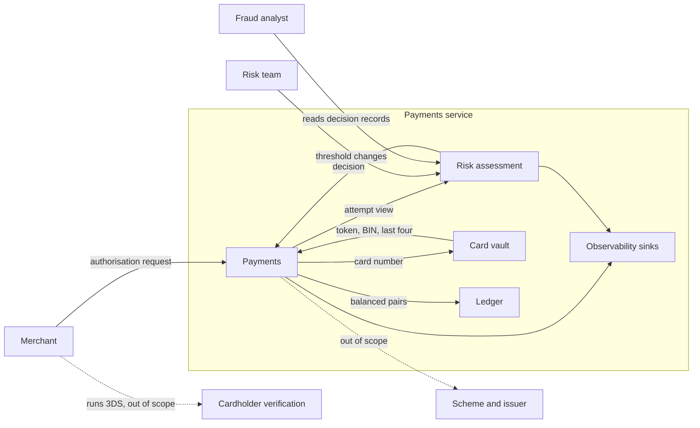

# Architecture: Authorisation risk check

Owner: payments-architecture. Version 0.1, draft for engineering.
Related: [`specs/product/authorisation-risk.md`](../product/authorisation-risk.md),
[`specs/architecture/authorisation-risk-threat-model.md`](authorisation-risk-threat-model.md),
[`specs/tech/payments.md`](../tech/payments.md)

This document sets boundaries and constraints. It does not choose the design. Engineering
proposes that in its technical spec, and architecture reviews it against this document.
Numbers marked *scenario value* were set for this exercise.

## Context

The payments service is the gateway between merchants and the card scheme. Every
authorisation enters through `authorise()` in `src/payments/service.ts`. Today nothing
judges an attempt before funds are reserved. This feature adds that judgement inside the
same service. It is not a new service.

## Bounded contexts

| Context | Exists today | Owns | Never does |
|---------|--------------|------|------------|
| Payments | Yes, `src/payments/` | The authorisation lifecycle, idempotency, payment state | Decide risk |
| Risk assessment | No, new | Judging an attempt, the risk policy values in force, decision records | Write payment state or ledger entries, or see a full card number |
| Card vault | Yes, `src/vault.ts` | The card number, and anything derived from it | Hand the card number to another context |
| Ledger | Yes, `src/domain/ledger.ts` | Balanced double-entry pairs | Decide whether money should move |
| Observability | Yes, `src/obs/` | The five sinks a value can leave through | Receive anything not already redacted |

How they relate:

- **Payments asks, risk assessment answers.** Payments passes an attempt view and acts on
  the decision. Risk assessment has no reference back into payments.
- **Risk assessment sees an attempt, not a payment.** The attempt view carries only what
  the rules need: a card reference, BIN, merchant, countries, amount, currency and time. It
  keeps risk assessment independent of how payments models a payment.
- **Identity comes from the caller context.** The merchant, its country and any
  policy-administration role come from a caller context supplied by the gateway's
  authentication layer. This exercise simulates that layer: the caller of the service passes
  the context, and the service trusts it. Request bodies never carry identity.
- **The vault is the only source of card identity.** Any reference used to recognise the
  same card is produced inside the vault (see the compliance spec, card data).

## Ubiquitous language

Use these words in specs, code and tests, with these meanings.

| Term | Meaning |
|------|---------|
| Attempt | One authorisation request as it arrives, before any decision. A retry with a seen idempotency key is not a new attempt |
| Decision | The outcome for an attempt: approve, challenge or decline |
| Rule | One clause of the risk policy, RP1 to RP3 |
| Window | The rolling period a rule counts over |
| Card reference | A stable value that recognises the same card across attempts without being the card number |
| Decision record | What was decided, by which rule, on which values, under which policy values |
| Policy values | The thresholds and windows in force at a moment |
| Caller context | Who is calling: the merchant and its country, or a policy administrator and their role |
| Verification result | Proof from the merchant's 3DS provider that the cardholder completed a challenge |

## Domain rules

The four existing invariants still hold: `LEDGER_BALANCED`, `CAPTURE_WITHIN_AUTH`,
`REFUND_TRACES_CAPTURE` and `NO_PAN_AT_REST`. This feature adds three, which must be
assertable the same way, after any generated sequence of operations:

- An attempt that is not approved reserves nothing and writes no ledger entries.
- Every attempt has exactly one decision record while records for it are retained.
- No decision record holds a full card number.

Candidate domain events, for engineering to confirm or replace: `AttemptDeclined`,
`AttemptChallenged`, `PolicyValuesChanged`.

## Constraints

| Constraint | Value | Why |
|------------|-------|-----|
| Time added to an authorisation | 20 ms at p99, *scenario value* | Authorisation sits inside the scheme's response deadline |
| Reproducible decisions | The same attempt, history and time give the same decision | A decision has to be explainable later and testable now |
| Bounded memory | Every new in-memory store has a maximum size or retention period, and defined behaviour when it is reached | A card-testing flood is exactly the traffic that grows it |
| No new dependencies | `package.json` declares none | A repository rule. `npm run verify` enforces it |
| In memory | No database, no network | As for the rest of the service |

## Decisions left to engineering

- Where the check sits in `authorise()`, relative to the idempotency lookup and tokenisation
- How rule state and windows are held, and how time reaches the rules
- The shape of the attempt view, the decision and the decision record
- How policy values are held and changed at runtime
- How verification results are matched and marked as used
- The limit and eviction rule for each new store
- What `Payment` and the authorise result look like for a challenge or decline

## Decisions engineering does not make

Thresholds, the fraud and approval trade-off, behaviour when the check fails, and what a
merchant is told. The PRD names an owner for each.
